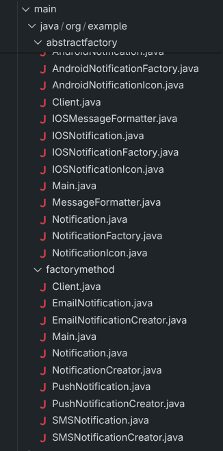

# Assignment 2 - Factory Method & Abstract Factory

## Theme

Notification System

This project demonstrates the factory method and abstract factory
design patterns using a notification system.

## Part A - Factory Method

Factory method is used to create a single notification product.

Notification types:

- Email

- SMS

- Push

Notification is the common product interface.

NotificationCreator defines the factory method and contains the business method for sending notifications.

Each concrete creator creates its own notification type.

The client works with NotificationCreator and does not directly create
concrete notification objects.

## Part B - Abstract Factory

Abstract factory is used to create a family of related notification components for a specific platform.

Supported families:
- Android
- iOS

Each family contains:
- Notification
- MessageFormatter
- NotificationIcon

NotificationFactory defines the creation methods for the whole family.

The client receives the factory through composition and works only with
abstract interfaces. The concrete family is selected in one place in
App.java.

## Factory Method vs Abstract Factory

Factory Method creates one product and relies on inheritance: concrete
creator subclasses override the factory method.

Abstract Factory creates a family of related products and relies on
composition: the client receives a factory object and uses its creation
methods.

## SOLID

### Open/Closed Principle

New notification types can be added by introducing new concrete products
and creators without changing the existing notification creation logic.

### Single Responsibility Principle

Product creation is separated from the client and business logic through
the factory classes.

## Project Structure

## Run
### Factory Method
./gradlew runFactoryMethod

### Abstract Factory
./gradlew runAbstractFactory